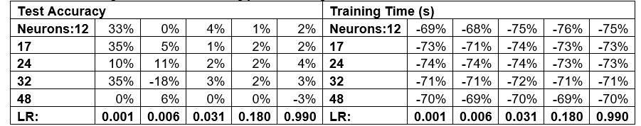
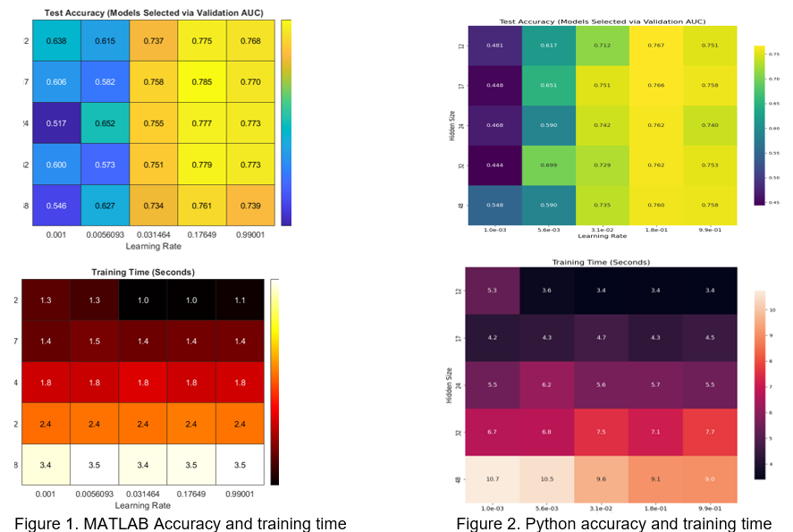

# Credit Card Default Prediction: MATLAB vs. Python Neural Network Comparison

  
*Example visualization of test accuracy across hyperparameters (see `Results/` folder).*

## Overview
This project compares the performance of MATLAB and Python in training a neural network to predict credit card defaults. Using a dataset of 30,000 customers with 24 features, we implemented a single hidden-layer MLP with varying hyperparameters (hidden layer sizes and learning rates). Key findings include:
- **MATLAB outperformed Python** by 6% in average test accuracy and 72% in training speed.
- Learning rates strongly influenced accuracy, while hidden layer size impacted training time.
- Class imbalance (77.9% non-default) was addressed using weighted loss functions and AUC evaluation.

## Repository Structure
├── code/ # Source codes

│ ├── python/ # Python implementation (training, evaluation, visualization)

│ └── matlab/ # MATLAB scripts (data preprocessing, model training, heatmaps)

├── data/ # Dataset and preprocessing files

│ └── default of credit card clients.xls

├── docs/ # Project documentation (literature review, methodology)

├── results/ # Visualizations

│ ├── accuracy_heatmap.png # Test accuracy heatmaps

│ ├── training_time_heatmap.png # Training time heatmaps

│ └── lr_loss_curve.png # Learning rate vs. loss curve

└── README.md

## Dataset
**Source**: [UCI Default of Credit Card Clients](https://archive.ics.uci.edu/dataset/350/default+of+credit+card+clients)  
**Preprocessing**:
- Z-score normalization for skewed features (e.g., billed amounts).
- 80/20 train-test split with 5-fold cross-validation.
- Class weights applied to handle imbalance (`class_weights = [2.89, 0.43]`).

## Methodology
### Model Architecture
- **Single hidden-layer MLP** with ReLU (hidden) and sigmoid (output) activations.
- **Hyperparameters**:
  - Hidden layer sizes: `[12, 17, 24, 32, 48]` (based on Heaton's rules).
  - Learning rates: `[0.001, 0.006, 0.031, 0.180, 0.990]` (using triangular learning rate test and then geometric grid search).
  - L2 regularization (`λ = 0.001`), 500 epochs, SGD optimizer.

### Training
- **Evaluation Metric**: AUC (due to class imbalance).
- **Class Weighting**: Penalized misclassifications of the minority class.
- **Learning Rate Range Test**: Implemented per Smith (2017) to determine optimal rates.

## Results
### Key Findings
| Metric                | MATLAB  | Python  |
|-----------------------|---------|---------|
| Average Test Accuracy | 70%     | 67%     |
| Average Training Time | 2s      | 7.2s    |
| Best AUC              | 0.729   | 0.720   |

*Training time heatmap for Python (MATLAB showed similar trends but 70% faster).*

### Hyperparameter Impact
- **Learning Rate**: Accuracy peaked at `lr=0.18`, then declined due to local optima.
- **Hidden Layer Size**: No significant accuracy improvement beyond 24 neurons, but training time tripled from 12 to 48 neurons.

## Usage
### Dependencies
- **Python**: `numpy`, `pandas`, `scikit-learn`, `matplotlib`
- **MATLAB**: Statistics and Machine Learning Toolbox

Conclusion & Future Work
While MATLAB demonstrated superior efficiency, the model's high false-negative rate remains a limitation. Future improvements:

Apply SMOTE or weighted loss functions for better class balance.

Explore probabilistic outputs for risk assessment.

Enhance interpretability using techniques like SHAP values.

References
Yeh & Lien (2009) - ANN performance in credit scoring.

Smith (2017) - Cyclical Learning Rates.

Heaton (2017) - Hidden layer sizing rules.

For detailed code and visualizations, explore the code/ and results/ folders.

   
